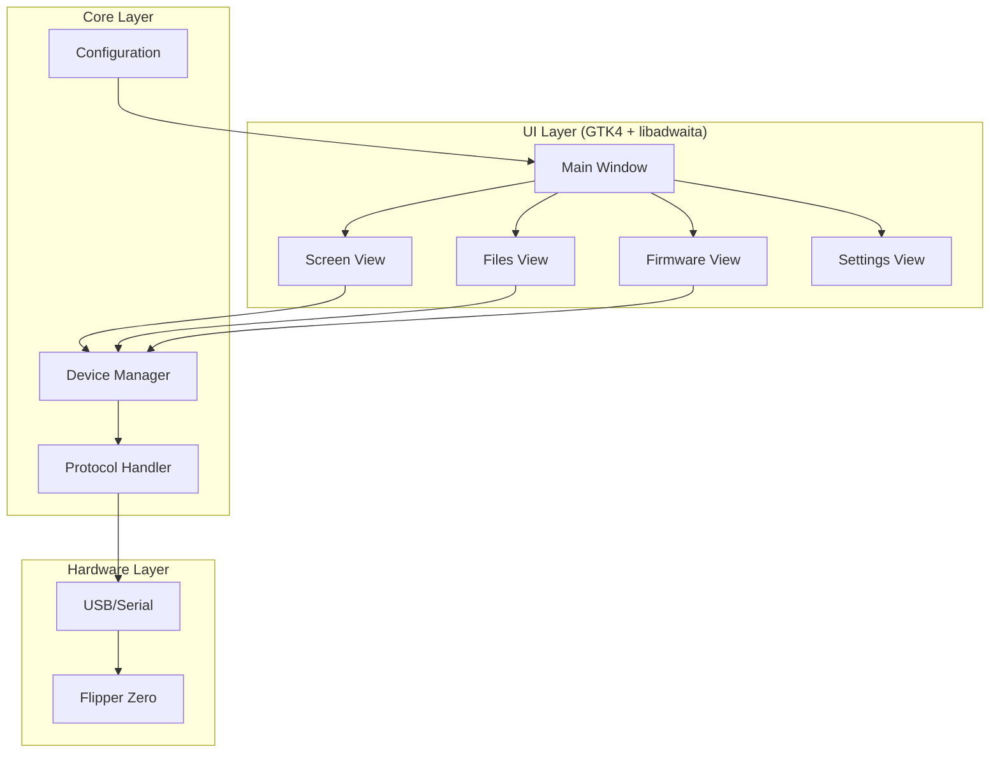

# PineFlip 🐬

<div align="center">


**A professional Flipper Zero companion application for Linux**

[](LICENSE)
[](https://www.rust-lang.org)
[](https://gtk.org)
[](https://gnome.pages.gitlab.gnome.org/libadwaita/)

</div>

## ✨ Features

### 🖥️ Live Screen Mirroring
- Real-time display mirroring from your Flipper Zero
- Adjustable frame rate and scaling
- Screenshot capture with one click
- Screen recording to GIF

### 🎮 Remote Control
- Full D-pad control via keyboard or on-screen buttons
- Button mapping customization
- Low-latency input

### 📁 File Manager
- Browse internal and SD card storage
- Upload and download files
- Create, rename, and delete files/folders
- Drag-and-drop support

### 🔄 Firmware Management
- Check for firmware updates
- Support for official and custom firmware:
  - Official Flipper firmware
  - Momentum Firmware
  - Xtreme Firmware  
  - Unleashed Firmware
  - RogueMaster
- One-click firmware installation

### ⚙️ Modern UI
- Built with GTK4 and libadwaita
- Follows GNOME Human Interface Guidelines
- Dark/light mode support
- Responsive sidebar navigation

## 📸 Screenshots

<div align="center">

| Screen Mirror | File Manager | Firmware Update |
|:-------------:|:------------:|:---------------:|
|  |  |  |

</div>

## 🚀 Installation

### Dependencies

**Fedora/RHEL:**
```bash
sudo dnf install gtk4-devel libadwaita-devel
```

**Ubuntu/Debian:**
```bash
sudo apt install libgtk-4-dev libadwaita-1-dev
```

**Arch Linux:**
```bash
sudo pacman -S gtk4 libadwaita
```

### Building from Source

```bash
# Clone the repository
git clone https://github.com/bad-antics/pineflip.git
cd pineflip

# Build release version
cargo build --release

# Install (optional)
sudo cp target/release/pineflip /usr/local/bin/
```

### USB Permissions

To access the Flipper Zero without root, add a udev rule:

```bash
# Create udev rule
sudo tee /etc/udev/rules.d/42-flipperzero.rules << 'EOF'
# Flipper Zero serial port
SUBSYSTEMS=="usb", ATTRS{idVendor}=="0483", ATTRS{idProduct}=="5740", MODE="0660", TAG+="uaccess"
# Flipper Zero DFU mode
SUBSYSTEMS=="usb", ATTRS{idVendor}=="0483", ATTRS{idProduct}=="df11", MODE="0660", TAG+="uaccess"
EOF

# Reload udev rules
sudo udevadm control --reload-rules
sudo udevadm trigger
```

## 📖 Usage

### GUI Mode (Default)

```bash
pineflip
```

### CLI Mode

```bash
# Screen mirror in terminal
pineflip --cli --mirror

# Specify port
pineflip --port /dev/ttyACM0

# Enable debug logging
pineflip --debug
```

### Keyboard Shortcuts

| Action | Shortcut |
|--------|----------|
| Connect | `Ctrl+K` |
| Disconnect | `Ctrl+Shift+K` |
| Screenshot | `Ctrl+S` |
| Record | `Ctrl+R` |
| Refresh | `F5` |
| Upload | `Ctrl+U` |
| Download | `Ctrl+D` |

### D-Pad Controls

| Button | Key |
|--------|-----|
| Up | `↑` or `W` |
| Down | `↓` or `S` |
| Left | `←` or `A` |
| Right | `→` or `D` |
| OK | `Enter` or `Space` |
| Back | `Backspace` or `Esc` |

## 🏗️ Architecture



## 🔧 Configuration

Configuration is stored in `~/.config/pineflip/config.toml`:

```toml
[connection]
auto_connect = true
timeout_secs = 5
auto_reconnect = true

[screen]
frame_rate = 10
scale = 4
invert_colors = false

[files]
show_hidden = false
confirm_delete = true

[appearance]
follow_system_theme = true
compact_mode = false
```

## 🤝 Contributing

Contributions are welcome! Please feel free to submit a Pull Request.

1. Fork the repository
2. Create your feature branch (`git checkout -b feature/amazing-feature`)
3. Commit your changes (`git commit -m 'Add amazing feature'`)
4. Push to the branch (`git push origin feature/amazing-feature`)
5. Open a Pull Request

## 📜 License

This project is licensed under the GPL-3.0 License - see the [LICENSE](LICENSE) file for details.

## 🙏 Acknowledgments

- [Flipper Zero](https://flipperzero.one/) - The amazing multi-tool device
- [GTK](https://gtk.org/) - The GIMP Toolkit
- [libadwaita](https://gnome.pages.gitlab.gnome.org/libadwaita/) - Building blocks for modern GNOME apps
- Inspired by [qFlipper](https://github.com/flipperdevices/qFlipper) and various community tools

## ⚠️ Disclaimer

This is an unofficial third-party application. PineFlip is not affiliated with, endorsed by, or connected to Flipper Devices Inc. Use at your own risk.

---

<div align="center">

Made with 🦀 and ❤️ for the Flipper Zero community

</div>
